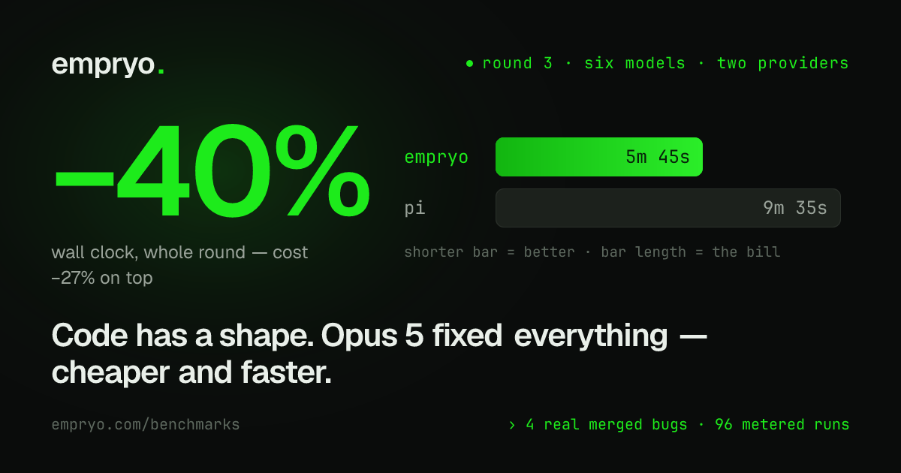

<div align="center">

# Empryo vs pi — the bill is the judge

Real merged bugs, reported the way humans report them · hidden acceptance tests ·
**one API key per agent**, so the provider's bill — not anyone's telemetry — decides.

<br>

<a href="https://empryo.com/benchmarks/forge-v2">
  
</a>

<p>
  <a href="https://empryo.com/benchmarks/forge-v2"><b>full story & charts</b></a> ·
  <a href="round-3/"><b>the harness</b></a> ·
  <a href="https://empryo.com/blog/code-has-a-shape"><b>how the engine works</b></a>
</p>

</div>

## Latest — Round 3 · six models, two providers · Aug 2026

[Empryo](https://empryo.com)'s Forge v2 engine vs [pi](https://github.com/badlogic/pi-mono)
at its leanest possible shape. Four real merged bugs (hono + opencode), models from
Haiku 4.5 to Opus 5 across Anthropic **and** OpenAI, every Anthropic dollar metered on
the wire by a local proxy. 96 recorded runs.

<table>
  <tr>
    <th align="left">tier</th>
    <th align="left">result</th>
    <th align="left">detail</th>
  </tr>
  <tr>
    <td><b>Opus&nbsp;5</b></td>
    <td><b>−27% cost · −40% wall clock</b></td>
    <td>$2.27 vs $3.10 a round, both fixed 4/4</td>
  </tr>
  <tr>
    <td><b>GPT-5.6&nbsp;luna</b></td>
    <td><b>100% fixed vs 88%</b></td>
    <td>the only accuracy gap on the board — in Empryo's favor</td>
  </tr>
  <tr>
    <td><b>Haiku&nbsp;4.5</b></td>
    <td><b>−11% wall clock</b> <sup>*</sup></td>
    <td>same bugs fixed</td>
  </tr>
  <tr>
    <td><b>vs our own Forge&nbsp;v1</b></td>
    <td><b>half the price</b></td>
    <td>Opus −56% · terra −46% · luna went from fixing half to fixing all</td>
  </tr>
</table>

**The smarter the model, the cheaper Empryo gets** — strong models know what to do
with a live map of the code, so v2 hands them the short tour and skips the manual.
Accuracy never finished behind pi on any tier. Every run, both agents, raw:
[`round-3/results/`](round-3/results/).

<sub>* On Haiku a one-cent helper model preps the ground first; pi ran barebone.</sub>

## All rounds

<table>
  <tr>
    <th align="left">round</th>
    <th align="left">what</th>
    <th align="left">harness</th>
    <th align="left">full story</th>
  </tr>
  <tr>
    <td><b>3</b> · Aug 2026</td>
    <td>six models, two providers — Opus 5: <b>−27% cost, −40% wall clock</b></td>
    <td><a href="round-3/"><code>round-3/</code></a></td>
    <td><a href="https://empryo.com/benchmarks/forge-v2">empryo.com/benchmarks/forge-v2</a></td>
  </tr>
  <tr>
    <td><b>2</b> · Jul 2026</td>
    <td>five real bugs from hono, zod and ky — <b>7/10 vs 6/10 fixed, −23% billed</b></td>
    <td><a href="harness-real/"><code>harness-real/</code></a></td>
    <td><a href="https://empryo.com/benchmarks/pi-round-2">empryo.com/benchmarks/pi-round-2</a></td>
  </tr>
  <tr>
    <td><b>1</b> · Jul 2026</td>
    <td>hookboard fixture — <b>8/9 vs 7/9 fixed, 5.7× fewer input tokens</b></td>
    <td><a href="harness/"><code>harness/</code></a> + <a href="fixture/"><code>fixture/</code></a></td>
    <td><a href="https://empryo.com/benchmarks/pi-round-1">empryo.com/benchmarks/pi-round-1</a></td>
  </tr>
</table>

All rounds, console-audited: **[empryo.com/benchmarks](https://empryo.com/benchmarks)**

## The accounting finding

Separate keys per agent make the provider's own billing page the ground truth —
and let us audit each agent's self-reported cost against it:

- **Empryo's self-report matched the bill in every round** — round 1 to the token
  and the cent, round 2 within 2¢ of display rounding.
- **pi under-reported in both audited rounds**: 73% of its input tokens missing in
  round 1; $2.94 (32% of its bill) invisible in round 2 — a crashed cell burned
  eight minutes of billed model work and reported $0.00.

If you benchmark agents on self-reported numbers, use separate keys.

## Reproduce

Every round validates for free before a token is spent, then reproduces with your
own keys:

```sh
# round 3 — six models, two providers
cd round-3 && bun install && cp .env.bench.example .env.bench
./run-final.sh haiku                              # ~$3 a round · REPS=3 for medians

# round 2 — real-world bugs
bun harness-real/validate.ts                      # no API keys needed
bun harness-real/run-real.ts --tiers haiku,opus

# round 1 — hookboard
bun harness/run-vs.ts --sanity                    # zero LLM calls
```

Single runs are stochastic — expect per-cell variance; the aggregate direction
reproduced across every round for us. Tasks are real merged fixes chosen past the
models' training cutoffs, with git history rewritten to one baseline commit so the
answer is unreachable.
